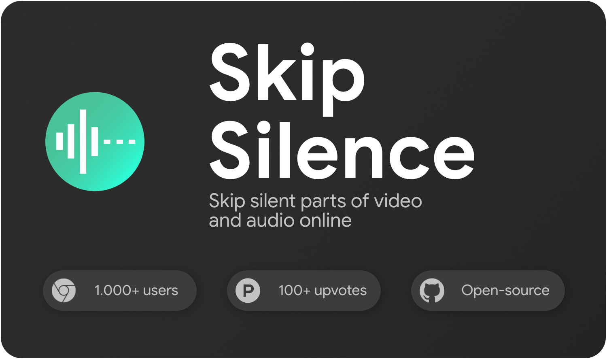

<p align="center">
    <br />
    <a href="https://chrome.google.com/webstore/detail/skip-silence/fhdmkhbefcbhakffdihhceaklaigdllh">
        
    </a>
    <a href="https://addons.mozilla.org/de/firefox/addon/skip-silence/">
        
    </a>
    <a href="https://microsoftedge.microsoft.com/addons/detail/skip-silence/njflliajflcedhfmpmhdekhmejekonmc">
        
    </a>
    <a href="https://www.buymeacoffee.com/vantezzen" target="_blank">
      
    </a>
</p>

# Skip Silence

"Skip Silence" is a browser extension that allows you to automatically skip parts of a video that are silent.
It is highly inspired by CaryKH's [automatic on-the-fly video editing tool](https://www.youtube.com/watch?v=DQ8orIurGxw).
The extension works with most websites that use HTML5 `audio` and `video` elements (like YouTube).

## Demo


(Video used: Unedited part of <https://youtu.be/DQ8orIurGxw?t=234>)

## Installation

"Skip Silence" is available through the [chrome web store](https://chrome.google.com/webstore/detail/skip-silence/fhdmkhbefcbhakffdihhceaklaigdllh).
You can also install this extension on Chrome by downloading the source from GitHub and loading the unpacked, built extension through "chrome://extensions" as a "Temporary Add-On".

## Firefox

"Skip Silence" only has **restricted** support for Firefox.

On Chrome, "Skip Silence" uses a browser API to support analyzing audio on almost all websites. Unfortunately, Firefox currently doesn't support this API and thus the extension doesn't work on some websites. Take a look at [open bugs](#open-browser-bugs) for more info.

If you have problems with the extension on a website on Firefox, you can try using a Chromium-based browser like Ungoogled Chromium.

## Usage

When "Skip Silence" detects a compatible element on the current page, its icon in the menubar will be colored.


You can now click on this icon to reveal the settings popup.

You can now:

- Click the toggle button to enable and disable "Skip Silence" for the current page
- Change "Skip Silence"'s settings
- View the current volume using the VU meter
  - The VU Meter will be blue when on normal speed and green when currently in a silent part
  - The red line represents your current volume threshold

## Limitations

- Won't work on sites that use other methods to play video or audio (e.g. Spotify Web Player uses a special method to prevent songs from being downloaded)

## How does it work?

The extension attaches a JavaScript audio analyser to the current video or audio source and will speed up or slow down the video using the current volume of the audio.

## Open browser bugs

The extension sometimes seems to push the boundaries of what browsers can do. Due to this, some features that would be nice to have can't be implemented as the browsers contain bugs or missing features.

Current list of bugs/feature requests the extension is waiting for

- Chrome mutes tab when `preferCurrentTab: true` is set
  - https://bugs.chromium.org/p/chromium/issues/detail?id=1317964&q=preferCurrentTab&can=2
  - This would make selecting the tab for the "Screen capture" analyzer type easier
- Firefox doesn't support audio for screen capture
  - https://bugzilla.mozilla.org/show_bug.cgi?id=1541425
  - Due to this, the "Screen capture" analyzer type is not available on Firefox
- Firefox doesn't support the `tabCapture` API
  - https://bugzilla.mozilla.org/show_bug.cgi?id=1391223
  - Due to this, the "Tab-output analysis" analyzer type is not available on Firefox#
- Chrome MV3 doesn't support the `tabCapture` API
  - https://github.com/GoogleChrome/chrome-extensions-samples/issues/627
  - Due to this, Skip silence is currently still using MV2 on Chrome

## Development

This extension is using the [plasmo framework](https://docs.plasmo.com/) for developing and building.

To start development, follow these steps:

1. Check if your [Node.js](https://nodejs.org/) version is v18 or newer.
2. Clone this repository.
3. Run `pnpm install` to install the dependencies.
4. Run `pnpm dev` to start the development server for chrome or `pnpm dev:firefox` for Firefox.
5. Load your extension on Chrome following:
   1. Access `chrome://extensions/`
   2. Check `Developer mode`
   3. Click on `Load unpacked extension`
   4. Select the `build` folder.
6. Happy hacking.

## Build

Requirements:

- NodeJS 18
- preferably pnpm but npm will also work

Run these commands in the root of the extension files:

```bash
pnpm install # or npm install
pnpm run build # or npm run build
pnpm run build:firefox # or npm run build
```

After the build is done, the raw contents will be placed in `/build` and the compacted zip will be placed in `/build/[chrome/firefox]-mv2-prod.zip`.

## Contributing

Please fork this repository and create a new pull request to contribute to it.

If you notice any errors, please create a new issue on GitHub.

## License

Licensed under the [MIT License](LICENSE)
