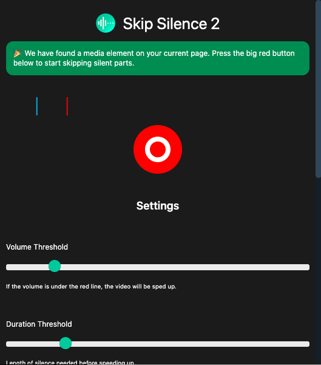
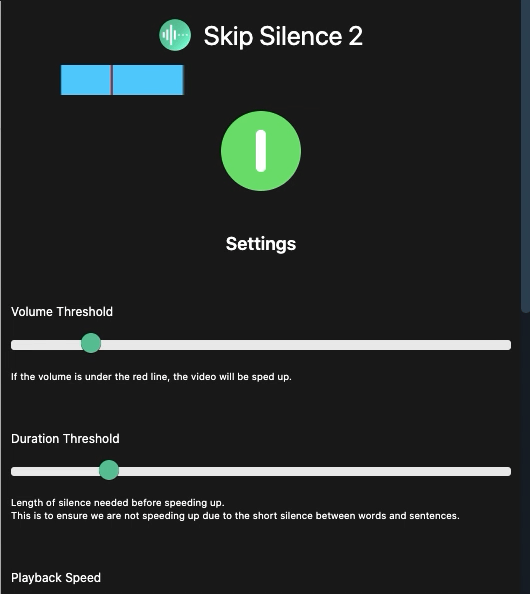

     
    

# Skip Silence 3 is out!

You are looking at the code for Skip Silence 2. I've since published Skip Silence 3 which completely rewrote the way Skip Silence works.

Skip Silence 1 and 2 were small, quick hobby projects that grew larger and larger and thus became more and more unmaintainable, chaotic and full of bugs. This is why I decided to dump Skip Silence 2's source code and rewrite the extension with React, Typescript, ES6 and Webpack, making it much more maintainable.

If you want to go to Skip Silence 3, please visit https://github.com/vantezzen/skip-silence/.

# Skip Silence 2
"Skip Silence" is a browser extension that allows you to autmatically skip parts of a video that are silent.
It is highly inspired by CaryKH's [automatic on-the-fly video editing tool](https://www.youtube.com/watch?v=DQ8orIurGxw).
The extension works with most websites that use HTML5 `audio` and `video` elements (like YouTube).

## Demo

(Video used: Unedited part of <https://youtu.be/DQ8orIurGxw?t=234>)

## Installation
"Skip Silence" is availible through the [chrome web store](https://chrome.google.com/webstore/detail/skip-silence/fhdmkhbefcbhakffdihhceaklaigdllh).
You can also install this extension on Chrome by downloading the source from GitHub and loading the unpacked extension through "chrome://extensions" as a "Temporary Add-On".

## Why is Firefox unsupported?
"Skip Silence" uses JavaScript's video.playbackRate and MediaSourceElement simultaneously to achieve its effect. Unfortunately, Firefox currently [has a bug](https://bugzilla.mozilla.org/show_bug.cgi?id=1517199) that stops video.playbackRate from working when already using MediaSourceElement - making this extension useless.

## Usage
When "Skip Silence" detects a compatible element on the current page, its icon in the menubar will be colored.

You can now click on this icon to reveal the settings popup.

You can now:
- Click the big red button to enable and disable "Skip Silence" for the current page
- Change "Skip Silence"'s settings
- View the current volume using the VU meter
  - The VU Meter will be blue when on normal speed and green when currently in a silent part
  - Additionally, on supported websites, the VU Meter can be yellow. This indicated that a silent part is comming up but hasn't been reached yet
  - The red line represents your current volume threshold

## Limitations
- Will only work when the tab is in focus. It will not work if the tab is in the background as it needs to do quick calculations which the browser will suspend for background tabs
- On websites that don't support the "pre-buffering" feature, the first few samples after a silent part may be skipped or will clip
- Won't work on sites that use other methods to play video or audio (e.g. Spotify Web Player uses a special method to prevent songs from being downloaded)

## How does it work?
The extension attaches a JavaScript audio analyser to the current video or audio source and will speed up or slow down the video using the current volume of the audio.
If the media source supports it, the extension will clone the element and play it a fraction of a second further than the current progress (the "pre-buffer" feature). This way, the extension can already detect what is going to happen then and can act accordingly, e.g. slow down the video before the silent part ends as to not skip the first few words after.
On some websites (e.g. YouTube) this "pre-buffering" is not possible though, as their media elements can not be cloned. This unfortunately results in the first few samples of audio after a period of silence will still be sped up, making words hard to understand.

## Contributing
Please fork this repository and create a new pull request to contribute to it.

If you notice any errors, please create a new issue on GitHub.

## License
Licensed under the [MIT License](LICENSE)
